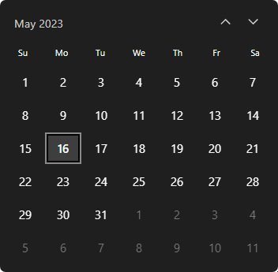

# React WinDate v1.1!


## Description

A react custom date input with windows calendar skin

## Installation
```bash
npm i react-windate
```
## Configuration

## Usage
```js
import { WinDateWrapper } from "react-windate";
```

## Options
```js
interface CalendarColors {
    /** background color behind calendar */
    background?: Color;
    headerButtonsText?: Color;
    headerButtonsTextHover?: Color;
    weekDaysText?: Color;
    chosenButtonText?: Color;
    /** border color of chosen day / month */
    chosenBorder?: Color;
    /** text color of today / current month */
    currentButtonBackground?: Color;
    currentButtonBorder?: Color;
    currentButtonSecondBorder?: Color;
    notCurrentButtonText?: Color;
    buttonBorderHover?: Color;
    disabled?: Color
    disabledBackground?: Color
}

type OnDateChangeProps = {
    /** updated Date formatted to "YYYY-MM-DD" string */
    formatted: string | "";
    /** updated Date */
    raw: Date | null;
};

interface Props {
    /** Custom colors to apply on calendar */
    calendarColors?: CalendarColors;
    /**
     * Props to apply on date input
     *
     * - accept all react input props and a onDateChange callback
     */
    inputProps: ComponentProps<"input"> & {
        /** Gets called whenever date gets updated from input or calendar */
        onDateChange: (date: OnDateChangeProps) => any;
        /** sets input value to today by default, set to false by default */
        setTodayByDefault: boolean;
    };
}
```

## Examples
### Basic usage


